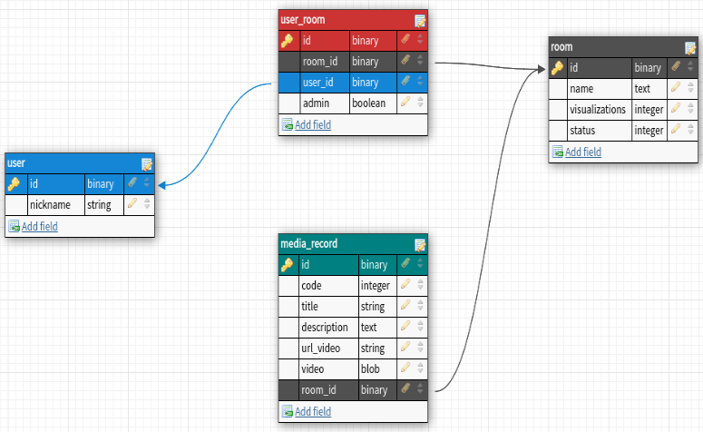

# README
Olá esta aplicação tem como objetivo a realização de teste de conhecimentos em Ruby on Rails e frameworks SPA front-end em arquitetura em estrutura REST Full utiliando as seguintes stacks

- Ruby 3.0.1
- Rails 6.1.7.1
- Node 18.13.0
- React 18.2.0
- Docker 20.10.22
- Postgres 15.1

A plataforma se trata de um compartilhador de videos em grupos o usuário pode compartilha videos com um grupo especifico ou deixa publico, então foi preciso desenha a regra de negocio e cheguei no seguinte MER.



Logo na pagina inicial do app usuário clicando em no botão começar, apresentará um formulario para o mesmo preencher com as seguintes informações 
* Nickname sera relacionando junto a grupo que so sera criado ao finalizar o formulario com as informações da sala.
* A sala com
  * Um toggle de publico ou privado no qual sendo publico qualquer pessoa com nickname pode assitir.
  * Ou privado sendo enviado um convite via link de accesso com um codigo.
  * E uma opção de enviar videos via uplaod ou links de videos em outras plataformas de midia.

* O video com:
  * Todos os atributos apresentados na tabela acima (obrigatórios).
  * Quando finalizar a sala criada tera sua referencia no video criando uma dependencia 1x1


### Consulta documentação completa

https://documenter.getpostman.com/view/8797440/2s8ZDeTJVU

## CONFIGURA O PROJETO EM LOCALHOST
* OBS: E fundamental que o docker e o docker compose estejam configurado.
```shell
sudo docker compose build
```
```shell
sudo docker compose up
```
```shell
sudo docker exec -it backend bundle exec rails db:drop db:create db:migrate
```

##### Abra seu navegador preferido e acesse http://localhost:3000


